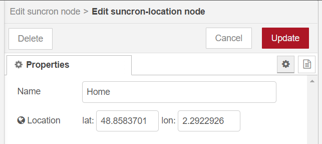
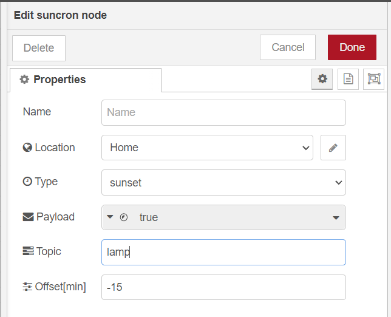

# SunCron

A Node-RED node that can output configurable messages at significant sun events

## Supported Sun Events

- Sunrise
- Sunrise End
- Golden Hour End
- Solar Noon
- Golden Hour
- Sunset Start
- Sunset
- Dusk
- Nautical Dusk
- Night
- Nadir
- Night End
- Nautical Dawn
- Dawn

## Configuration

For one of the above sun events a distinct `msg.payload` and `msg.topic` can be configured. It is also possible to specify an offset to adjust the event time.

The location (lat / lon) is set up via a configuration node to make reusing/identifying it easier.

## Outgoing messages

The node will emit messages at the specified sun event with the specified offset. Outbound messages will have a `msg.payload` and `msg.topic` as configured in the editor.

## Known issues

Depending on your configured location (lat / lon) and time of the year, you might notice some sun events not being triggered. This is not an error but how lighting works on earth. For example in polar regions, they sometimes have day (or night) for weeks at a time. But even in Berlin / Germany there might not always be a distinct 'night' event as the sun during summer does not go below the astronomical twilight treshold.

## Contributions and Suggestions

... are always welcome! Just file a GitHub [issue](https://github.com/Cyberbeni/node-red-contrib-suncron-pro/issues) or [pull request](https://github.com/Cyberbeni/node-red-contrib-suncron-pro/pulls)!
