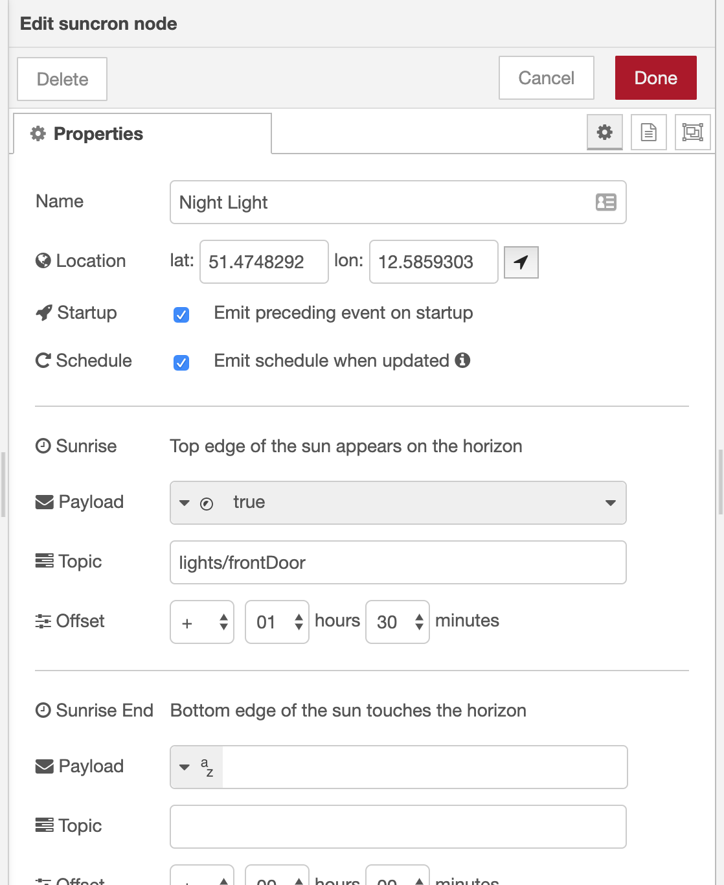

# SunCron

A Node-RED node that can output configurable messages at significant sun events

## Supported Sun Events

- Sunrise
- Sunrise End
- Golden Hour End
- Solar Noon
- Golden Hour
- Sunset Start
- Sunset
- Dusk
- Nautical Dusk
- Night
- Nadir
- Night End
- Nautical Dawn
- Dawn

## Configuration

For each of the above sun events a distinct `msg.payload` and `msg.topic` can be configured. It is also possible to specify an offset to adjust the event time.

The location (lat / lon) can either be entered manually or retrieved automatically from your browser via the location button.



The offsets can be overwritten at runtime by passing a config object as `msg.payload` to the suncron node. All attributes are optional. Offsets need to be expressed in seconds as positive or negative integer values. Below example adjusts the offset for the `dusk` event to -2 minutes (-120 seconds) and all others to 0 seconds.

```javascript
{
    "sunrise": 0,
    "sunriseEnd": 0,
    "goldenHourEnd": 0,
    "solarNoon": 0,
    "goldenHour": 0,
    "sunsetStart": 0,
    "sunset": 0,
    "dusk": -120,
    "nauticalDusk": 0,
    "night": 0,
    "nadir": 0,
    "nightEnd": 0,
    "nauticalDawn": 0,
    "dawn": 0
}
```

## Outgoing messages

### Sun events

The node will emit messages at the specified sun events (respecting offsets) or when it receives an inbound msg with a non-object paylod, e.g. `true`. Outbound messages will have a `msg.payload` and `msg.topic` as configured in the editor. Those messages also have a `schedule` attribute containing an object with details about the schedule of the current date. The schedule contains only events which have been configured with a payload.

Each event has the following attributes:

- `event` is the name of the sun event
- `sunEventTime` refers to the unadjusted time of the respective sun event.
- `cronTime` refers to the adjusted time, i.e. taking the offset into account.
- `offset` refers to the configured offset in seconds.

#### Example `msg.schedule` object

```javascript
{
  "sunrise": {
      "event": "sunrise",
      "sunEventTime": "2022-02-26T06:29:51",
      "cronTime": "2021-02-26T06:29:51",
      "offset": 0
  },
  "sunriseEnd": {
      "event": "sunriseEnd",
      "sunEventTime": "2022-02-26T06:33:24",
      "cronTime": "2022-02-26T07:33:24",
      "offset": 3600
  },
  "dawn": {
      "event": "dawn",
      "sunEventTime": "20221-02-26T05:54:49",
      "cronTime": "2022-02-26T05:44:49",
      "offset": -600
  }
  //...
}
```

### Schedule events

If the checkbox "Emit schedule when updated" is ticked, the node will emit additional messages whenever the schedule gets updated. This happens on startup, when offsets are overridden at runtime, and shortly after midnight. Those messages will contain the schedule object as `msg.payload` (same structure as above) and the string "suncron:schedule" as `msg.topic`.

## Known issues

Depending on your configured location (lat / lon) and time of the year, you might notice some sun events not being triggered. This is not an error but how lighting works on earth. For example in polar regions, they sometimes have day (or night) for weeks at a time. But even in Berlin / Germany there might not always be a distinct 'night' event as the sun during summer does not go below the astronomical twilight treshold.

## Contributions and Suggestions

... are always welcome! Just file a GitHub [issue](https://github.com/csuermann/node-red-contrib-suncron/issues) or [pull request](https://github.com/csuermann/node-red-contrib-suncron/pulls)!
